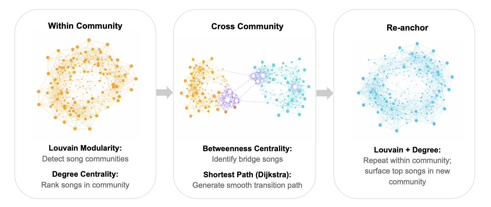

# Graph-Based Song Recommender

A graph-based recommender that moves from familiar songs (Louvain Modularity, Degree Centrality) to new communities by following natural transition paths (Betweenness Centrality, Shortest Path) in the graph.

Songs are loaded as graph nodes, with edge connections based on cosine similarity of audio feature vectors, for 5 nearest neighbors. Louvain modularity is used to detect communities and within communities, degree centrality identifies locally representative songs. Betweenness centrality identifies bridge songs across communities. Recommendations begin with familiar songs from the source community, then transition to a nearby community via a bridge node using Dijkstra shortest path.

Dataset: [Spotify Tracks Dataset](https://www.kaggle.com/datasets/maharshipandya/-spotify-tracks-dataset)

Live App: [View App](https://song-queue-generator-ftfayxrwrrtbjsy4d2gxu6.streamlit.app/)

Recommendation Flow:

## How to Run
1. Clone repository  
2. Install dependencies: `pip install -r requirements.txt`  
3. Start Neo4j locally (`bolt://localhost:7687`) and update username/pw in script  
4. Run notebook to build the graph and generate recommendations 